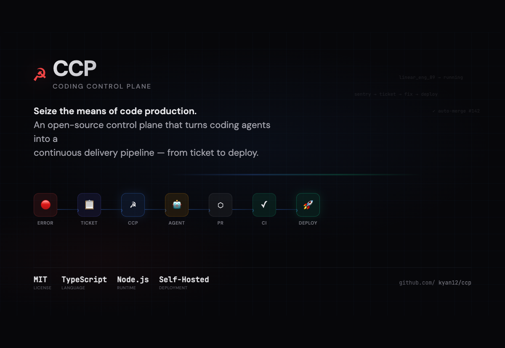
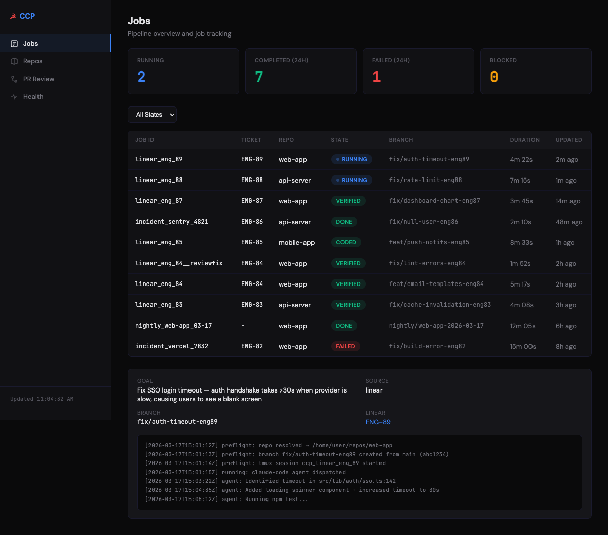
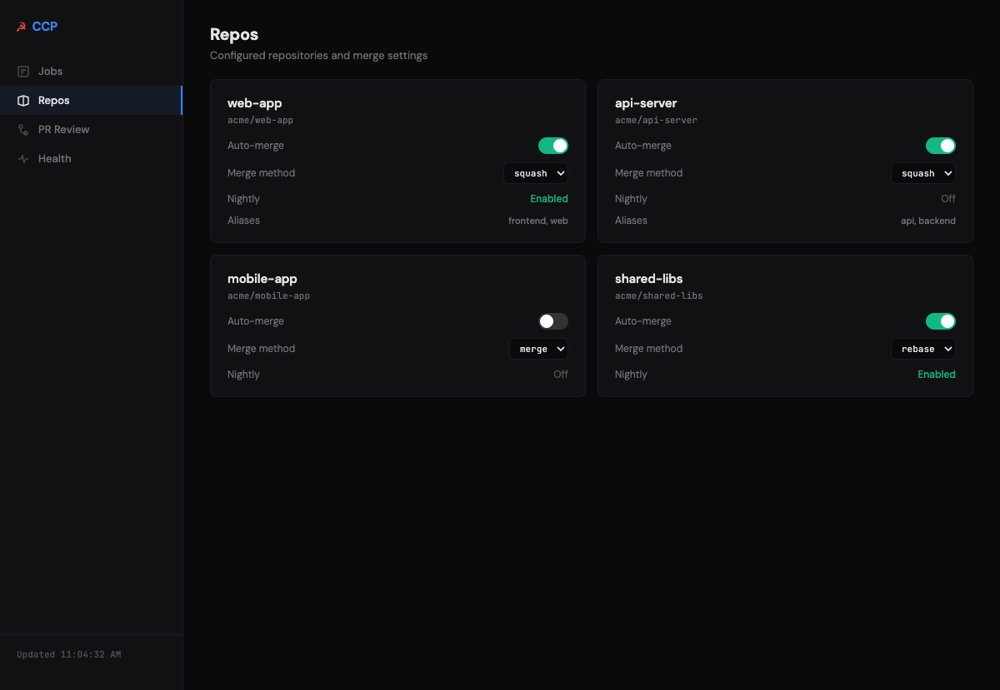
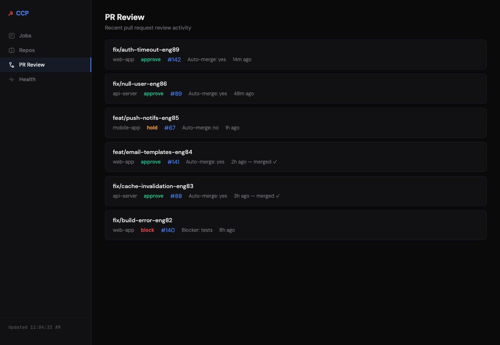
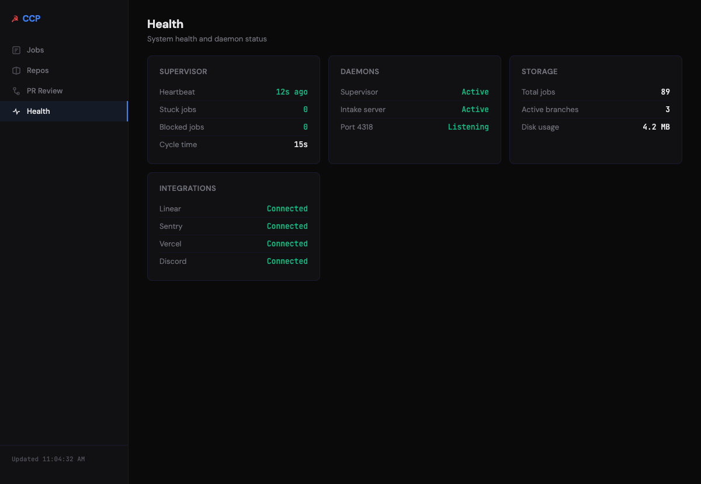

# ☭ CCP — Coding Control Plane

**Seize the means of code production.**

CCP is an open-source control plane that turns coding agents (Claude Code, Codex, etc.) into a continuous delivery pipeline. It handles the orchestration that nobody else does: ticket intake → job dispatch → coding → PR creation → review → auto-merge → error detection → remediation.

```
Linear Ticket → CCP → Coding Agent → PR → CI → Auto-Merge → Deploy
       ↑                                                        |
       └──── Sentry Error / Vercel Failure / CI Failure ────────┘
```



## What It Does

- **Job Pipeline** — Queue, dispatch, and monitor coding jobs with full lifecycle tracking
- **Linear Integration** — Auto-dispatch from Linear tickets, sync state back, create tickets from errors
- **PR Review & Auto-Merge** — Per-repo auto-merge config, CI check monitoring, disposition analysis
- **Remediation Loop** — CI failures auto-spawn fix jobs; errors → tickets → fixes → deploy
- **Webhook Intake** — Sentry errors, Vercel deploy failures, GitHub CI failures all create tickets
- **Discord Notifications** — Compact one-liners for runs, threads for non-clean outcomes
- **Dashboard** — Dark-themed web UI to monitor jobs, configure repos, track PR reviews
- **Nightly Runs** — Scheduled coding runs for maintenance, tech debt, compound tasks

## Architecture

```
┌──────────────────────────────────────────────────────────┐
│                     Intake Layer                          │
│  Sentry webhook ──┐                                      │
│  Vercel webhook ──┼── intake-server.ts ── normalize ──┐  │
│  GitHub webhook ──┘                                   │  │
│  Linear webhook ──── linear-dispatch.ts ──────────────┤  │
│  Discord message ── intake-text.ts ───────────────────┤  │
│                                                       ▼  │
│                     Job System (jobs.ts)                  │
│                     ┌────────────────┐                    │
│                     │ queued         │                    │
│                     │ → preflight    │                    │
│                     │ → running      │ ◄── tmux + claude  │
│                     │ → coded        │                    │
│                     │ → verified     │                    │
│                     └────────────────┘                    │
│                           │                              │
│              ┌────────────┼────────────┐                 │
│              ▼            ▼            ▼                 │
│         PR Review    Linear Sync   Notifications         │
│         (pr-review)  (linear.ts)   (Discord)             │
│              │                                           │
│              ▼                                           │
│         PR Watcher ── auto-merge / remediation           │
│         (every 15s)                                      │
└──────────────────────────────────────────────────────────┘
```

## Quick Start

### Prerequisites

- **Node.js** 20+
- **Claude Code** (`npm i -g @anthropic-ai/claude-code`) or another coding agent
- **GitHub CLI** (`gh`) authenticated
- **Linear** account with API key

### Install

```bash
git clone https://github.com/kyan12/ccp.git
cd ccp
npm install

# Configure
cp .env.example .env
cp configs/repos.json.example configs/repos.json
cp configs/linear.json.example configs/linear.json

# Edit .env with your API keys
# Edit configs/repos.json with your repositories
# Edit configs/linear.json with your Linear team/project IDs
```

### Run

```bash
# Start the supervisor (monitors and runs jobs)
node src/bin/supervisor.ts --interval=15000 --max-concurrent=1

# Start the intake server (receives webhooks, serves dashboard)
node src/bin/intake-server.ts

# Dashboard at http://localhost:4318/dashboard
```

### Create a Job Manually

```bash
node src/bin/intake-text.ts \
  --title "Fix login page timeout" \
  --repo my-app \
  --dispatch
```

### Run on macOS with launchd

```bash
# Generate and install launchd plists
node src/bin/install-launchd.ts
```

## Configuration

### `configs/repos.json` — Repository mappings

```json
{
  "mappings": [
    {
      "key": "my-app",
      "ownerRepo": "myorg/my-app",
      "localPath": "/home/user/repos/my-app",
      "aliases": ["app", "frontend"],
      "autoMerge": true,
      "mergeMethod": "squash"
    }
  ]
}
```

### `configs/linear.json` — Linear integration

```json
{
  "apiKeyEnv": "LINEAR_API_KEY",
  "teamId": "your-team-uuid",
  "teamKey": "ENG",
  "projectIds": {
    "product": "uuid-for-product-project",
    "reliability": "uuid-for-reliability-project"
  }
}
```

### Per-Repo Auto-Merge

Set `"autoMerge": true` in your repo config. CCP will:
1. Wait for all CI checks to pass
2. Attempt GitHub approval (skips if self-authored)
3. Squash merge (or rebase/merge per `mergeMethod`)

### Webhook Setup

| Source | Endpoint | Events |
|--------|----------|--------|
| Sentry | `/ingest/sentry` | Internal integration with `issue` events |
| Vercel | `/ingest/vercel` | `deployment.error`, `deployment.canceled` |
| GitHub | `/webhook/github` | `check_run`, `pull_request` |
| Linear | `/webhook/linear` | Issue create/update |

Expose your intake server via [Tailscale Funnel](https://tailscale.com/kb/1223/tailscale-funnel/), ngrok, or a public URL.

## Dashboard

Access at `http://localhost:4318/dashboard` when the intake server is running.



| | |
|---|---|
|  |  |
|  | |

## Job Lifecycle

```
queued → preflight → running → coded → verified → done
                        │
                        ├── blocked (missing deps, can't resolve repo)
                        ├── failed (agent error, timeout)
                        └── coded → PR created
                                      │
                                      ├── checks pass + autoMerge → merged ✅
                                      ├── checks fail → remediation job spawned 🔄
                                      └── needs review → thread created 💬
```

## The Error→Fix Loop

CCP's killer feature is the closed remediation loop:

1. **Runtime error** → Sentry captures → webhook → Linear ticket created
2. **Ticket dispatched** → coding agent fixes the bug → PR created
3. **CI passes** → auto-merge → deploy
4. **CI fails** → GitHub webhook → remediation job spawned with failure logs
5. **Deploy fails** → Vercel webhook → incident ticket created
6. Repeat until green ✅

## CLI Tools

| Command | Description |
|---------|-------------|
| `node src/bin/supervisor.ts` | Main supervisor loop |
| `node src/bin/intake-server.ts` | HTTP server for webhooks + dashboard |
| `node src/bin/intake-text.ts` | Create jobs from text descriptions |
| `node src/bin/jobs.ts list` | List all jobs and their states |
| `node src/bin/jobs.ts inspect <id>` | Inspect a specific job |
| `node src/bin/pr-watcher.ts --once` | Run one PR review cycle |
| `node src/bin/linear-dispatch.ts` | Dispatch pending Linear tickets |
| `node src/bin/linear-sync.ts <id>` | Sync a job's state to Linear |

## Environment Variables

| Variable | Required | Description |
|----------|----------|-------------|
| `LINEAR_API_KEY` | Yes | Linear API key |
| `CCP_DISCORD_RUNS_CHANNEL` | No | Discord channel for job notifications |
| `CCP_DISCORD_ERRORS_CHANNEL` | No | Discord channel for errors |
| `CCP_DISCORD_REVIEW_CHANNEL` | No | Discord channel for PR reviews |
| `CCP_PR_AUTOMERGE` | No | Global auto-merge default (`false`) |
| `CCP_PR_MERGE_METHOD` | No | Default merge method (`squash`) |
| `CCP_INTAKE_PORT` | No | Intake server port (`4318`) |
| `CCP_MAX_CONCURRENT` | No | Max concurrent jobs (`1`) |
| `VERCEL_TOKEN` | No | Vercel API token |
| `SENTRY_AUTH_TOKEN` | No | Sentry auth token |

## How It Compares

| | CCP | Devin | Raw Claude Code | GitHub Actions |
|---|---|---|---|---|
| Ticket → Code → PR | ✅ | ✅ | Manual | ❌ |
| Auto-merge on green | ✅ | ❌ | ❌ | ✅ (limited) |
| Error → Fix loop | ✅ | ❌ | ❌ | ❌ |
| CI failure remediation | ✅ | ❌ | ❌ | ❌ |
| Per-repo config | ✅ | ❌ | ❌ | ✅ |
| Dashboard | ✅ | ✅ | ❌ | ✅ |
| Self-hosted | ✅ | ❌ | ✅ | ❌ |
| Cost | Your API keys | $500/mo | Your API keys | Free tier |

## License

MIT — Seize it. Fork it. Ship it.

## Credits

Built by [Kevin Yan](https://github.com/kyan12) and [Crab 🦀](https://openclaw.ai) — an AI coding orchestrator running on [OpenClaw](https://openclaw.ai).
